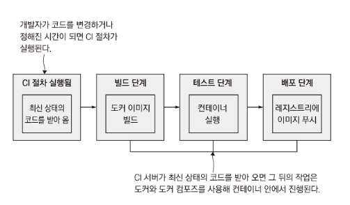
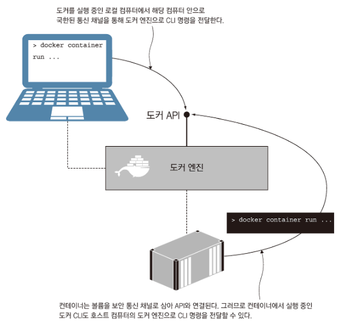
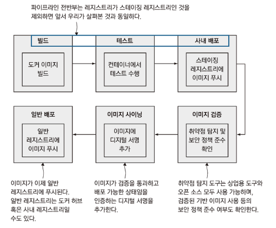

# 11장 도커와 도커 컴포즈를 이용한 애플리케이션 빌드 및 테스트



CI 단계가 모두 도커 또는 도커 컴포즈를 통해 수행된다. 따라서 CI 서버에 컴파일러나 SDK를 설치할 필요가 없다. 자동화된 단위 테스트는 이미지 빌드 단계에 포함되며 빌드가 깨졌다면 CI 절차도 해당 시점에서 중단된다.

또한 사용자 역할을 맡아 트래픽을 일으킬 별도 컨테이너를 실행하여 복잡한 E2E 테스트를 진행할 수 도 있다.

# 도커 CI 파이프라인의 이점

전체 CI 파이프 라인이 도커 컨테이너를 통해 실행되므로 다음과 같은 이점이 있다. 컨테이너는 도커 API, 그리고 같은 도커 엔진에서 실행된 컨테이너와 연결된다.

도커 CLI는 도커 API를 호출하는 방식으로 동작하기 때문에 다른 곳에 위치한 CLI도 같은 도커 엔진에 접속할 수 있다.



도커 API는 기본적으로 로컬 컴퓨터에서 실행이 된다. 도커 CLI를 통해 통신을 할 경우 호스트 컴퓨터 안으로 국한된 채널을 사용하는데 각 환경에 따라 다음과 같다.

- linux - socket
- windows - named pipes(npipe)

```docker
# docker-compose-linux.yml
version: "3.7"

services:
  jenkins:
    volumes:
      - /var/run/docker.sock:/var/run/docker.sock

# docker-compose-windows.yml
version: "3.7"

services:
  jenkins:
    volumes:
      - type: npipe
        source: \\.\pipe\docker_engine
        target: \\.\pipe\docker_engine
```

리눅스의 경우 바인드 마운트(socket - file)를 통해 통신이 이뤄지고, 윈도우는 [named pipes 마운트](https://docs.docker.com/storage/#named-pipes) 방식을 사용하게 된다.

# 의존 모듈이 불필요한 CI 작업 만들기

```docker
pipeline {
    agent any
    environment {
       REGISTRY = "registry.local:5000"
    }
    stages {
		    # 1. 검증
        stage('Verify') {
            steps {
                dir('ch11/exercises') {
                    sh 'chmod +x ./ci/00-verify.bat'
                    sh './ci/00-verify.bat'
                }
            }
        }
        # 2. 빌드
        stage('Build') {
            steps {
                dir('ch11/exercises') {
                    sh 'chmod +x ./ci/01-build.bat'
                    sh './ci/01-build.bat'
                }
            }
        }
        # 3. 테스트
        stage('Test') {
            steps {
                dir('ch11/exercises') {
                    sh 'chmod +x ./ci/02-test.bat'
                    sh './ci/02-test.bat'
                }
            }
        }
        # 4. 푸시
        stage('Push') {
            steps {
                dir('ch11/exercises') {
                    sh 'chmod +x ./ci/03-push.bat'
                    sh './ci/03-push.bat'
                    echo "Pushed web to http://$REGISTRY/v2/diamol/ch11-numbers-web/tags/list"
                    echo "Pushed api to http://$REGISTRY/v2/diamol/ch11-numbers-api/tags/list"
                }
            }
        }
    }
}

# 다음은 01-build.bat 스크립트의 내용이다
docker-compose -f docker-compose.yml -f docker-compose-build.yml build --pull
```

젠킨스에서 CI 파이프 라인을 실행하는데 도커 컨테이너를 사용하게 되면 특별한 의존성 설치 과정을 생략할 수 있다. 이로 인해 빌드 도구들의 버전을 최신으로 유지할 필요가 없고, 빌드 서버도 필요하지 않게 된다.

## 숨고 프론트엔드 CI 파이프라인

```docker
# 검증
- master_merge_check
- deployment
	# 빌드
	- Build with npm and docker
	# 배포
	- Deploy to EKS
	- Upload build files to S3
- upload_source_map
- add-git-tag
- generate-release-note
- merge_target_into_master
```

빌드 단계에 도커 컨테이너를 사용하기 때문에 마찬가지로 빌드 의존성 설치나 빌드 서버를 설치할 필요가 없다.

# CI 파이프라인에 관계된 컨테이너

앞서 살펴봤던 것처럼 CI 파이프라인에 도커 컨테이너를 사용하면, 최상위 레이어가 항상 동일해진다.



도커에서는 이런 CI 파이프라인을 안전 소프트웨어 공급 체인(secure software suply chain)이라고 부르는데, 기업 규모에 상관없이 배포할 소프트웨어의 안정성을 담보한다는 점에서 매우 중요하다.
