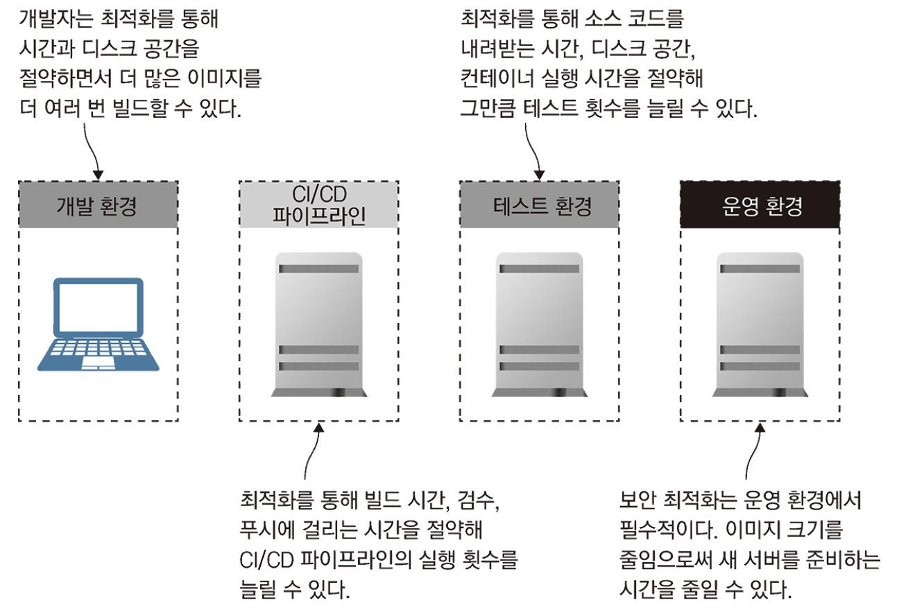
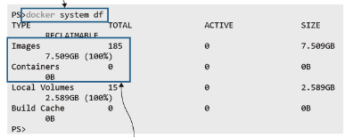

# 17장 도커 이미지 최적화하기: 보안, 용량, 속도

이미지 최적화에 필요한 이미지 포맷의 세부 사항을 알아보자.

# 도커 이미지를 최적화하는 방법

도커는 데이터를 보수적으로 다루기 때문에, 명시적으로 내려받은 이미지를 제거하지 않으면 자동으로 삭제 되지 않는다.



실행된 컨테이너가 없음에도 이미지 용량만으로 7.509GB나 된다.

따라서 주기적으로 docker system prune 명령을 실행해 사용하지 않는 이미지 레이어나 빌드 캐시를 비워주는 것이 좋다.

기술 스택을 최적화 하는 작업은 작언 개선을 지속적으로 반복하는 형태가 많지만, 도커에서는 간단한 베스트 프랙티스를 준수하는 것만으로도 큰 폭의 개선이 가능하다.

## 1. 꼭 필요한 파일만 이미지에 포함시켜라

실제 Dockerfile 스크립트를 작성하다보면 사용되지 않을 임시 파일이나 문서 파일까지 한꺼번에 디렉터리 채로 이미지에 포함하는 경우가 많다. 이런 임시 파일이나 문서 파일들이 디스크 용량을 차지하게 되면서 낭비로 이어지게 된다.

```docker
# Dockerfile v1 – 전체 디렉터리 구조를 이미지에 복사함
FROM diamol/base
CMD echo app- && ls app && echo docs- && ls docs
COPY . .

# Dockerfile v2 – 불필요한 파일을 별도로 삭제함
FROM diamol/base
CMD echo app- && ls app && echo docs- && ls docs
COPY . .
RUN rm -rf docs
```

- 질문: v2로 빌드된 이미지의 용량은 v1 보다 작을까?
  (힌트) 유니온 파일 시스템
  Docker 스크립트의 인스트럭션은 하나마다 이미지 레이어가 생기고, 전체 레이어가 모두 합쳐져 전체 이미지가 된다. 한 번 이미지에 복사된 파일은 이미지에서 뺄 수 가 없다. 따라서 다음 레이어에서 파일을 지우더라도 파일 시스템에서 숨겨질 뿐 실제로 파일이 삭제되진 않는다.

      이미지의 마지막 레이어나 중간 레이어로도 컨테이너를 실행할 수 있다. 다만 파일 시스템의 내용이 해당 레이어까지 병합된 상태가 되기 때문에 마찬가지로 파일이 제외되지 않는 형태이다.

## 2. .dockerignore 파일을 사용해 불필요한 파일을 제외해라

도커의 빌드 과정은 엔진에 [빌드 컨텍스트](https://docs.docker.com/build/building/context/)(빌드를 실행한 디렉터리)를 압축하고 Dockerfile 스크립트를 함께 보내면서 시작된다.

- Build context
  빌드 컨텍스트는 빌드가 액세스 할 수 있는 파일 셋이다. 빌드가 접근 가능한 컨텍스트의 종류는 다음과 같다.
  - 파일 시스템 컨텍스트(Filesystem contexts)
  - 텍스트 파일 컨텍스트(Text file contexts)
    파일 시스템 컨텍스트의 경우 로컬 파일 시스템 또는 원격 파일 시스템(깃 레파지토리 등)이 해당되며, 텍스트 파일 시스템의 경우 Dockerfile 하나를 의미하며 Dockerfile이 로컬 파일에 의존하지 않는 것을 의미한다.

이 빌드 컨텍스트가 생성되면서 불필요한 파일이 포함되는 경우가 많은데, .dockerignore 파일을 통해 빌드 컨텍스트에서 파일을 제외할 수 있다.

# 좋은 기반 이미지를 고르는 법

기반 이미지의 크기는 디스크 용량이나 네트워크 전송 시간뿐만 아니라 애플리케이션 보안과도 관계가 깊다.

컨테이너 관점에서 다양한 도구들은 보안상의 허점이 될 수 있다(ex: curl).

> 참고 사항으로 리눅스 컨테이너에는 **알파인 리눅스, 데비안 슬림** 이미지를 추천하며, 윈도 컨테이너는 **나노 서버**를 기반 이미지로 사용하는 것이 좋다.

너무 많은 기능 또는 테스트 코드를 컨테이너가 가지고 있으면, 공격자에 의해 보안이 위험해질 수 있다. 따라서 기반 이미지는 애플리케이션 실행에 필요한 모든 것을 갖춰야 하지만, **빌드에 필요한 도구를 포함시켜서는 안된다.**

> Node.js나 파이썬 같은 인터프리터 언어는 빌드 도구가 애플리케이션 실행에도 사용되므로 여기에 해당되지 않는다.

## 골든 이미지

골든 이미지를 사용하면 이러한 문제를 피할 수 있는 한 가지 방법이다. 직접 만든 골든 이미지는 업데이트 주기를 스스로 결정할 수 있고 골든 이미지 빌드 후에 바로 이어서 애플리케이션 빌드를 진행할 수도 있다.

또한 이미지 보안 검사를 위한 서드파티 도구(앤코어 등)를 골든 이미지에 삽입해 빌드 중 보안 검사를 할 수 있다는 장점도 있다.

# 이미지 레이어 수와 이미지 크기는 최소한으로

소프트웨어를 설치하면 패키지 목록을 캐싱하거나 추천 패키지 등을 함께 설치하기 때문에 대부분의 경우 불필요한 요소나 설치 후 잔재가 발생한다. 따라서 이런 요소까지 확실하게 통제할 수 있어야 한다.

```docker
# v1
FROM debian:stretch-slim

RUN apt-get update
RUN apt-get install -y curl=7.52.1-5+deb9u16
RUN apt-get install -y socat=1.7.3.1-2+deb9u1

# v2
FROM debian:stretch-slim

RUN apt-get update \
 # 최적화 옵션을 추가하였다
 && apt-get install -y --no-install-recommends \
    curl=7.52.1-5+deb9u16 \
    socat=1.7.3.1-2+deb9u1 \
 # 설치 후 패키지 목록의 캐시도 삭제한다
 && rm -rf /var/lib/apt/lists/*
```

두 버전을 빌드해보면 약 20MB 가량 차이가 난다.

위 v2에서 작성한 것처럼 여러 개의 RUN 인스트럭션을 합치는 데엔 장점이 있다.

- 여분의 레이어를 남겨둘 수 있고(최대 레이어 개수는 주로 127개)
- 컨테이너 파일 시스템의 내용을 추적하기도 훨씬 쉽다.
- 다운로드-압축 해제-삭제 까지의 단계를 하나에 처리하므로 쓸모 없는 디렉터리 구조가 생기지 않는다.
- 질문: 이런식으로 여러 개의 RUN 인스트럭션을 한 줄로 쓰지 않고 최적화할 수 있는 방법이 있을까?
  정답은 멀티 스테이지 빌드를 사용하는 것!

# 멀티 스테이지 빌드를 한 단계 업그레이드하기

멀티 스테이지 빌드는 컴파일 단계와 패키징 단계를 구분하여 최종 결과 이미지를 최적화 하기에 유리하다. 멀티 스테이지를 사용하는 것이 Dockerfile 스크립트 작성 베스트 프랙티스라고 할 수 있다.

```docker
# docker의 멀티 스테이지 빌드는 target을 지정하여 원하는 타겟까지만 빌드할 수 있다
docker image build -t diamol/ch17-ml-dataset:v3-download -f Dockerfile.v3 --target download .
```

이런 식으로 타겟을 지정하게 되면, 각 빌드 단계별 이미지 용량을 확인할 수 있다.

멀티 스테이지 빌드는 각 단계 별로 캐싱되기 때문에 데이터를 다운로드 하는 스테이지를 적절히 분리하여 성능 향상도 시킬 수 있다. 다만 RUN 인스트럭션을 사용해 내려받거나 설치한 다른 소프트웨어처럼 불필요한 요소까지 캐싱하지 않도록 주의해야 한다.

그리고 이미지에 패키지를 추가할 때는 정확한 버전을 명시해 실행 또는 업데이트 대상을 명확히 한다.

- 질문: 왜 버전을 정확하게 명시하는 것이 좋을까?

  ```docker
  # 업데이트를 통해 저장소 목록을 최신 상태로 업데이트 한다
  RUN apt-get update
  # 새 버전이 적용 되므로 이전 캐시가 무효화 된다.
  RUN apt-get install -y curl

  # 업데이트를 통해 저장소 목록을 최신 상태로 업데이트 한다
  RUN apt-get update
  # 명시된 버전이 있으므로 이전 캐시를 사용한다. 버전을 변경하지 않는 한 캐시가 무효화 될 일은 없다.
  RUN apt-get install -y curl=7.52.1-5+deb9u9
  ```

# 최적화가 중요한 이유

Dockerfile 스크립트 최적화를 위한 베스트 프랙티스를 살펴봤다.

- 기반 이미지 잘 고르기
- 아주 간단한 애플리케이션이 아닐면 멀티 스테이지 빌드 사용하기
- 불필요한 패키지나 파일 포함시키지 않기
- 자주 수정하는 인스트럭션을 제일 후순위로 배치하여 캐시 활용하기


