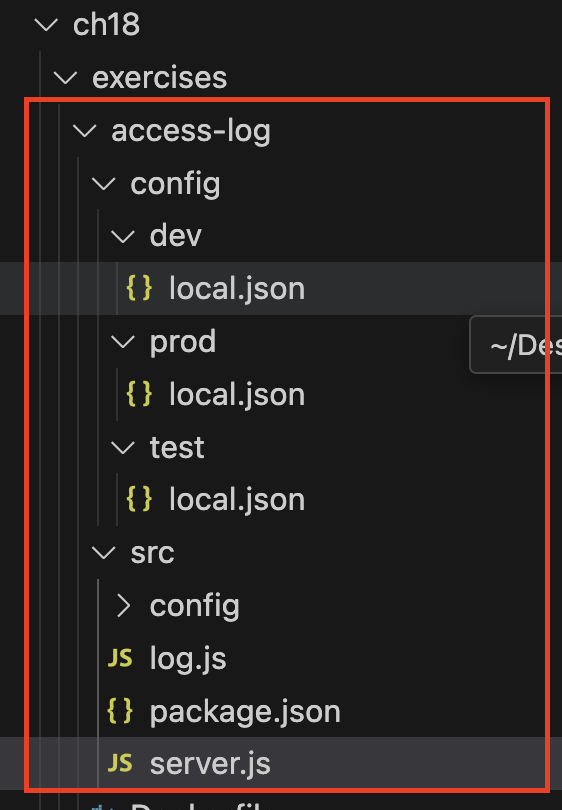

# 18장 컨테이너의 애플리케이션 설정 관리

# 환경에 따른 애플리케이션 설정

<aside>
💡 도커는 컨테이너에서 실행되는 애플리케이션에 환경을 만들어 주며, 환경 변수를 설정하고 파일 시스템을 구성한다.

</aside>

앞서 10장과 13장을 통해서 도커 컴포즈의 환경 변수 설정에 대해서 설명했습니다. 18장에서는 주로 실제 배포 환경에서 활용할 수 있는 local/dev/prod와 같은 운영환경별 애플리케이션 설정에 관해 이야기합니다.

애플리케이션의 언어와 프레임워크에 따라 설정 관리 라이브러리를 통해 도입되므로 일부는 개발의 영역에 속하여있습니다.

## Node.js의 node-config를 사용하는 예시

**access-log 애플리케이션의 구조**

access-log는 2개의 디렉토리에서 설정 파일을 읽어 오게됩니다.

- config: 기본 설정으로 도커 이미지로 포함되는 설정
- config-override : 이미지에 포함되지 않았지만 컨테이너 파일 시스템에 주입되는 설정

### 컨테이너에서 설정 파일 주입

컨테이너에서 설정 파일을 주입하는 방법에는 여러 가지가 있습니다. 일반적으로 다음 두 가지 방법을 사용합니다:

1. **볼륨 마운트**: 호스트 파일 시스템의 디렉토리를 컨테이너 내부로 마운트하여 설정 파일을 주입합니다.

   미리 정의된 경로에서 오버라이드 설정 파일을 읽어 들이도록 해 두면, 어떤 경로로든 컨테이너 파일 시스템에 설정 파일을 주입하기만 하면 해당 설정을 적용할 수 있습니다.

2. **환경 변수**: 환경 변수를 통해 설정을 전달하고, 애플리케이션에서 이를 읽어 사용합니다.

**action item : 볼륨 마운트, 바인드 어느 설명이 맞는지…**



이미지에 포함된 기본 설정 컨테이너

```docker
docekr container run -d -p 8080:80 diamol/ch18-access-log
```

로컬 디렉토리의 파일로 설정을 오버라이드한 컨테이너 - **볼륨 마운트로 설정 파일을 주입하는 방식**

```docker
docker container run -d -p 8081:80 -v "$(pwd)/config/dev:/app/config-override" diamol/ch18-access-log
```

오버라이드 설정 파일과 환경 변수로 설정을 구성한 컨테이너

```docker
docker container run -d -p 8082:80 -v "$(pwd)/config/dev:/app/config-override" -e NODE_CONFIG='{\"metrics\":{\"enabled\":"\true\"}}' diamol/ch18-access-log
```

### **환경변수 값이 선택되는 우선순위**

- Compose 파일에 직접 입력한 값
- 쉘 환경변수로 등록한 값
- 환경변수 파일로 입력된 값(`.env` 등)
- Dockerfile을 통해 삽입된 값
  ```docker
  FROM mysql:8
  ENV MYSQL_ROOT_PASSWORD password
  ```

Docker Compose에서의 환경변수 관리 방법에는 공통적인 단점이 하나 있다. **모든 정보가 평문(`plain text`)으로 저장된다는 것 입니다.**

나머지 닷넷, Go, 레거시 예제 모두 동일한 포맷으로 진행되는 애플리케이션 설정 관리를 실습입니다. 18장은 각 케이스에 따라 빌드된 이미지를 커맨드 레벨에서 환경별로 설정값을 주입하고 있습니다. 중요한 것은 다양한 언어, 프레임워크, 레거시 상태에서 동일한 패턴으로 환경변수를 다룰 수 있다는 것 입니다.

이 과정에서는 앞서 말했듯이 예제 실습 파일과 같이 개발단에서 환경별 설정 분리에 대한 고려가 이루어져야합니다.

현재 숨고 프론트엔드는 github secrets로 env 변수를 주입

.env에 이러한 aws key와 관련된 정보는 제거되는게 맞지 않을지

```
NEXT_PUBLIC_AWS_ACCESS_KEY_ID=***
NEXT_PUBLIC_AWS_SECRET_ACCESS_KEY=***
```

**action item 파편화된 환경변수 설정 일원화 @Nick LuckyNicky**
